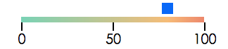
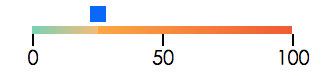

# D3-components
(React)components with D3.js

####1.slider组件 
  antd的slider组件只实现了滑动区域的上色，对于未滑动区域并没有色彩展示。 
  于是决定使用D3.js实现滑块左右两侧均有色彩展示的sliderComponent,同时渐变色彩中心会变化。 
  使用D3.js(v4)的scaleLinear && axis && SVG 实现。
  
####2.样式 
(1)初始化时: 

 
(2)右滑动时: 

 
(3)左滑动时: 

